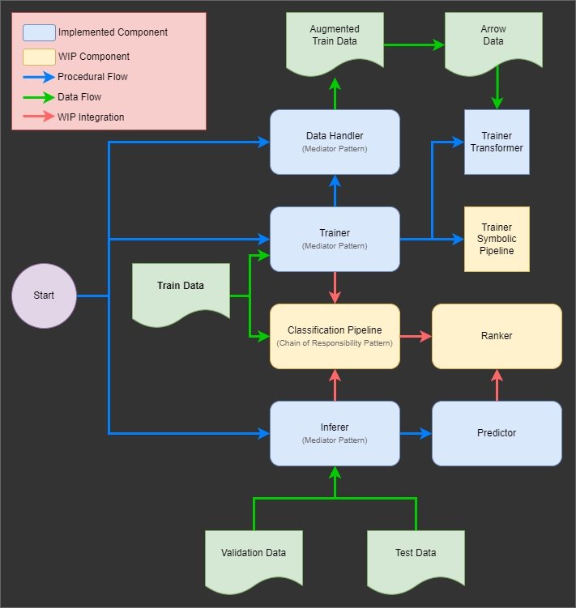

# README

`search-intent` is an application for intent understanding of user search queries. Its objective is to identify the most relevant market/product/service category for a given user search query.

## Content

1. High-level application logical design.
2. Project and dependencies installation, and data and model setup.
3. Data pre-processing and transformations for downstream tasks.
4. Model selection and training.
5. Model evaluation and performance metrics.
6. Classification of unlabelled data.
7. Assumptions and Potential Improvements

## Overall Design

The mainline of the application is composed of three mediator components:

* **Data Handler**: Mediates reading, splitting, augmenting, transforming, and storing data sets.
  * Coordinates the data pre-processing pipeline.
* **Trainer**: Mediates training of transformer model and hyperparameter optimization.
  * Due to hardware limitations, model training was done on cloud servers, but the application has been adapted to be able to train a model given the correct underlying hardware.
* **Inferer**: Mediates inference of models and model evaluation.
  * Initial design consists on two inference strategies to be triggered in parallel and their results ensembled:
    * An inference model operating on continuous space, i.e. a supervised ML model.
    * An inference model operating on discreet space, i.e. a knowledge base used to pull in context to enrich search queries and categories.
  * However, given the time constraint, only the continuous space implementation is operational so far.



## Installation

### Project Setup

1. Clone the project:

    ```bash/powershell/cmd
    git clone git@github.com:leobeeson/search-intent.git
    ```

2. Create virtual env:

    ```bash/powershell/cmd
    python3 -m venv .venv
    ```

3. Activate virtual env:

    ```bash/zsh
    source .venv/bin/activate
    ```

    ```powershell
    .venv\Scripts\Activate.ps1
    ```

    ```cmd
    .venv\Scripts\activate.bat
    ```

4. Install Python dependencies:

    ```bash
    pip install -r requirements.txt
    ```

5. To edit or contribute to the package, run from the project's root directory:

    ```bash/zsh
    pip install -e .
    ```

### Downloading the Train and Test Datasets

1. Download the Training Data Set [by clicking here](https://s3-eu-west-1.amazonaws.com/adthena-ds-test/trainSet.csv)
2. Download the Test Data Set [by clicking here](https://s3-eu-west-1.amazonaws.com/adthena-ds-test/candidateTestSet.txt)
3. Move both files to the `./data` folder in the project.
   * Assuming the files were downloaded to your `Downloads` folder:

    ```bash/zsh
    mv <path-to-downloads-directory>/trainSet.csv <path-to-project>/data
    mv <path-to-downloads-directory>/candidateTestSet.txt <path-to-project>/data
    ```

4. Verify the `./data` folder contains the right content. From the project's root folder:

    ```bash/zsh
    ls -la data
    ```

    Output:

    ```bash
    total 29232
    drwxr-xr-x  4 <your user> <your user>     4096 May 12 00:23 .
    drwxr-xr-x 13 <your user> <your user>     4096 May 12 00:50 ..
    drwxr-xr-x  5 <your user> <your user>     4096 May 12 01:20 arrow_cache
    drwxr-xr-x  5 <your user> <your user>     4096 May 12 01:20 arrow_cache_dev
    -rw-r--r--  1 <your user> <your user>  1429381 May  8 14:33 candidateTestSet.txt
    -rw-r--r--  1 <your user> <your user>    24945 May 11 14:19 labelled_data_dev.csv
    -rw-r--r--  1 <your user> <your user> 15672800 May  8 14:30 trainSet.csv
    -rw-r--r--  1 <your user> <your user>      107 May 11 03:38 unlabelled_test_set_dev.txt
    ```

    * Notice `trainSet.csv` is present:
      * This file contains the labelled data for model training.
    * Notice `candidateTestSet.txt` is present:
      * This file contains the unlabelled data for evaluating the task.
    * **Important**: The `arrow_cache` is necessary for the [Transform Data to DatasetDict Format](README.md#transform-data-to-datasetdict-format) step down below.
    * Dev files and a `arrow_cache_dev` containing a small sample of data have been provided:
      * You can ignore them, or use them for quick tests of end-to-end functionalities.
    * **Important**: Configuration variables in `./config.ini` point to `trainSet.csv` and `candidateTestSet.txt`.
      * If you want to change `trainSet.csv` and `candidateTestSet.txt` files names, please update the new names in the `./config.ini` file too, in the lines:

        ```config
        path_labelled_data = ./data/trainSet.csv
        path_unlabelled_test_data = ./data/candidateTestSet.txt
        ```

### Using Alternative Datasets

If you wish to use another labelled training data file, and/or another unlabelled test data file, you have two options:

1. Replace current data files:
   1. Replace the csv file in `./data/trainSet.csv` and/or in `./data/candidateTestSet.txt` with your new dataset.
   2. **Important**: As mentioned above, make sure your new file is also named `trainSet.csv` and/or `candidateTestSet.txt`, if you don't also modify the `./config.ini` file.
2. Modify `config.ini` file.
   1. Open the `./config.ini` file.
   2. Modify the relevant file path to point to the new file, e.g.:

    ```config
    path_labelled_data = ~/some-temp-file/labelled_train_set.csv
    path_unlabelled_test_data = ~/some-temp-file/unlabelled_test_data.txt
    ```

Technically you can replace the `trainSet.csv` file with a file with a different name **AND** update the new file name in `config.ini`, but either is sufficient.

### Downloading the Transformer Model Files

1. Download the transformer model files from [this link](https://distilbert-sequence-classification-ad-queries.s3.eu-west-2.amazonaws.com/distilbert_best_model.zip).
2. Unzip the zipped folder.
3. Move the unzipped folder to the `./ml_models_best_model` folder in the project:
   * Assuming you unzipped the file to your `Downloads` folder:

    ```bash/zsh
    mv <path-to-downloads-directory>/distilbert_best_model <path-to-project>/ml_models
    ```

4. Verify the unzipped file is in the right place and contains the following files. From the project's root folder:

    ```bash/zsh
    ls -la ml_models/distilbert
    ```

    Output:

    ```bash
    total 266148
    drwxr-xr-x 2 <your_user> <your_user>      4096 May 10 01:58 .
    drwxr-xr-x 3 <your_user> <your_user>      4096 May 11 00:52 ..
    -rw-r--r-- 1 <your_user> <your_user>     67165 May 10 01:58 config.json
    -rw-r--r-- 1 <your_user> <your_user> 272214189 May 10 01:58 pytorch_model.bin
    -rw-r--r-- 1 <your_user> <your_user>       125 May 10 01:58 special_tokens_map.json
    -rw-r--r-- 1 <your_user> <your_user>       372 May 10 01:58 tokenizer_config.json
    -rw-r--r-- 1 <your_user> <your_user>    231508 May 10 01:58 vocab.txt
    ```

    * The model files are `config.json` and `pytorch_model.bin`, while the rest correspond to distilbert's tokenizer.
    * Make sure the model AND the tokenizer files are present. The latter are necessary for tokenising and encoding new training data or test data into a format on which the model can operate.

## Data Pre-Processing

### Split Labelled Dataset into Train, Validation, and Test Sets

To train a model, split the labelled data set into train, validation, and test. The default fractions used were 80% for train data, 10% for validation data, and 10% for holdout test data. Additionally, the default splitting is stratified per label category:

```bash
python3 main.py split
```

To split the data without stratifying it:

```bash
python3 main.py split --no-stratify
```

### Augment Train Set

To balance the train set classes, you can augment the train set by increasing its right skewness up to a specified percentile on the distribution of records per category. The default value for the percentile is 25, which means that all categories with less records than the records per category of the category at the 25th percentile will be upsampled (with replacement) up until they reach the same number of records as the category at the 25th percentile.

Instead of balancing the records per category up to a uniform distribution, this augmentation enables strengthening the signal from under-represented classes without significantly dampening the signal from the most representative classes in the data.

To augment the train data with the *default degree* of increased right skewness run:

```bash
python3 main.py augment
```

To augment the train data with with a *different degree* of increased right skewness run, e.g. up to the 50th percentile:

```bash
python3 main.py augment --percentile 50
```

### Transform Data to DatasetDict Format

We're using the `DatasetDict` class from the `datasets` library to format our data, since it stores data on disk in Arrow format, enabling efficient IO operations. Transformed data is localised at `./data/arrow_cache`.

For future operations, a proper external NoSQL database can be used to store and apply version control to our corpora, but we're storing datasets locally given the scope of the current task.

To transform the split and/or augmented data to a `DatasetDict` class and store on disk in Arrow format:

```bash
python3 main.py transform
```

## Model

### Model Selection: DistilBertForSequenceClassification

The DistilBertForSequenceClassification model is a particularly suitable candidate for classifying search queries among 1419 different categories. DistilBERT, a distilled and lighter version of BERT, has been shown to capture the essential information from text while being computationally efficient. It is designed for tasks requiring an understanding of the semantic content of input text, making it ideal for classifying short search queries. The model's ability to handle a large number of classes and its capacity to work well even with short and sometimes ambiguous text data, like search queries, is a significant advantage in this context.

Moreover, the structure of our data and problem also influenced the choice of DistilBertForSequenceClassification over other methods. For instance, I considered a centroid-based sentence embedding approach which would represent each category as a centroid embedding aggregated from among the search queries assigned to it. However, given the unbalanced nature of our dataset and significant conceptual overlaps among many classes, I anticipated that the embedding space might not provide clear, distinct clusters for each category. This could lead to poorer performance in categorization.

Furthermore, the data comprises particularly short search queries - the median length is just 3 words, the average is 3.14 words, and the 95th percentile is only 5 words. This provides very little context from which to distinguish between categories, making the task quite challenging. A model like DistilBertForSequenceClassification, which is adept at extracting maximum context from minimal input, is therefore a fitting choice. It can effectively capture the limited semantic information in these queries to deliver a high signal-to-noise ratio, making it a robust choice for this specific task.

### Model Weaknesses

Despite the robustness and efficacy of DistilBertForSequenceClassification in tackling a multi-class classification task, it isn't without its limitations. One of the primary challenges lies in the model's inherent complexity which can lead to increased computational costs and slower inference times, particularly in large-scale, real-time applications. Furthermore, as a token-based model, DistilBert may struggle to fully capture semantic meanings from extremely short queries such as unigrams, especially those composed of ambiguous or polysemous terms.

Potential areas for improvement could include the incorporation of additional context or external knowledge bases, such as user browsing history or domain-specific ontologies, to better resolve the ambiguity in short queries. Further experimentation with model architecture, such as employing ensemble methods or investigating newer transformer models, could also yield performance enhancements.

### Training a DistilBertForSequenceClassification

If you intend to train the model with a different dataset, please make sure you have the necessary underlying hardware.

**Note**: The model was not trained using the below command; the model supplied with the application was trained on Google Colab with the following [runbook](docs/train_distilbert_ad_queries_2_augmented_shuffled_wo_test_fraction.ipynb).

Run with caution from `main`, as it has not been tested:

```bash
python3 main.py train
```

### Hyperparameter Optimization

This is a time-consuming process, so please make sure you have the necessary underlying hardware before running.

**Note**: Hyperparameter optimization was also performed on Google Colab. For the results of the hyperparameter optimization performed to find improved parameters for distilbert, see [runbook 1](docs/model_distilbert_optimisation_1_1.ipynb) and [runbook 2](docs/model_distilbert_optimisation_1_2.ipynb).

Run with caution from `main`, as it has not been tested:

```bash
python3 main.py optimize
```

## Model Evaluation

The dataset presented a significant challenge due to the unbalanced nature of its class distribution. To address this and ensure a more accurate measure of the model's performance, I opted for the weighted F1-score as the primary evaluation metric. The weighted F1-score provides an average metric, but unlike its macro counterpart, it does so while considering the true frequency of each label in the data. This weighting mechanism enables the metric to encapsulate the model's performance across all classes, furnishing a more holistic view of the model's ability to handle both high-frequency and low-frequency classes in the dataset.

During the hyperparameter optimization process, however, I switched gears and leveraged the macro F1-score. This decision was influenced by the augmentation strategy in the data preprocessing, in which all classes that fall under the 25th percentile in terms of frequency are upsampled. As a result, the class distribution during the tuning phase was different from the original, unbalanced distribution. The macro F1-score was a logical choice in this scenario, as it treats all classes equally irrespective of their original frequency. This approach ensured that under-represented classes were given equal importance during the optimization process, promoting a more balanced learning and ultimately, a more generalized model.

To evaluate the distilbert model's performance, run:

```bash
python3 main.py evaluate --model distilbert
```

The current distilbert model evaluates to the following metrics:

```bash
Evaluation results:
        Accuracy = 0.63
        Macro F1 Score = 0.58
        Weighted F1 Score = 0.62
        Macro Precision = 0.58
        Weighted Precision = 0.62
        Macro Recall = 0.59
        Weighted Recall = 0.63
```

## Classifying Unlabelled Data

To perform classification of unlabelled data, run:

```bash
python3 main.py predict
```

If you wish to provide a different file for classification, you can pass the `--filepath` flag followed by the filepath to the different unlabelled data. This file has to be a `.txt` file or a single-column `.csv` file with no header.

## Architectural Considerations

At this stage it is not clear if the application will perform OLTP or OLAP, and this differentiation will have important implications on the application and model-serving architecture. However, I expect a non-trivial amount of search queries to be constantly classified, hence I assume the architecture must be capable of handling high volume streaming of data, and the following architectural considerations can be beneficial in either case:

* Containerization: Use Docker for consistent, portable environments.
* Caching: Store results of frequent or intensive queries to reduce response times.
* Asynchronous Processing: Use message queues and background workers for time-consuming tasks.
* Auto-scaling: Design for horizontal scalability based on predefined metrics.
* API Gateway: Implement for load balancing, request throttling, and security features.
* Monitoring and Logging: Integrate tools for telemetry, tracking performance, and identifying issues.

Optionally:

* Microservices: Given the mediator pattern used, provides modular, independent services for faster iteration.
* Model Serving: Utilize solutions like TensorFlow Serving or TorchServe for efficient model handling.

## Assumptions

* A specific search query can only be classified to a single category.
  * Early exploratory data analysis confirmed that the training data had only one category per search query.
* Classification of search queries are not being done in real time while the user is actively searching.
  * The current logical setup of `search-intent` is targetting batch processing of stored user search queries, e.g. pulled from a data warehouse.
  * For a real-time classification different architectures and modelling paradigm might be required.

## Code Smells

* Trainer is reaching into DataHandler. It would be ideal to completely decouple both mediators; though given their mediator nature, some level of coupling between them is not unnatural.

## Improvements

* Stream data instead of holding it in memory, so we can scale training and prediction to millions of search queries.
  * HuggingFace's `DatasetDict` class works with `Arrow` format and use data streaming.
  * But upstream we're reading and writing whole csv files; this can be improved.
* Use databases for data IO.
  * Could use a simple SQLite that comes pre-installed in Linux machines and python has `sqlite3` package out of the box.
  * My preference would be a NoSQL database, taking into account this application's future features.
* Fix existing unit tests and extend coverage.
* Extend logging beyond mediator classes.
* Complete WIP components for symbolic classification.

## License

* This project is licensed under the MIT License - see the LICENSE file for details.
